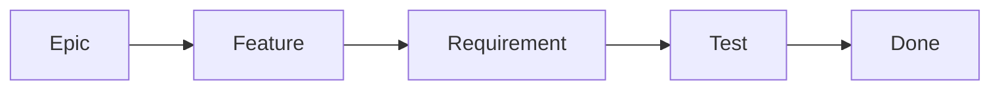

# Charte Kanban Disciplinee - InstantRelease

## 1. Objet
Ce document definit la methode de travail officielle du projet InstantRelease:
- methode: **Kanban discipline**
- outils: **GitHub Issues + GitHub Project (pilotage multi-repo)**
- objectif: augmenter le debit de livraison tout en gardant un niveau eleve de qualite, securite et tracabilite.

Ce document est operationnel et remplace toute pratique ad hoc.
Pour tout sujet d'organisation (roles, ownership, RACI), la source de verite est `docs/OBS.md`.
Pour toute politique qualite (tests, gates, DoR/DoD, derogations qualite, supply chain), la source de verite est `docs/PAQ.md`.
Pour les intentions officielles et le nom de la methode projet, la source de verite est `docs/PAQ.md` sections 2.1 et 2.2.
Pour la methode de risque et le registre des risques, la source de verite est `docs/RISK_MANAGEMENT_PLAN.md`.

## 2. Contexte projet
- Equipe: 1 manager, 2 dev DevOps, 2 dev FullStack web.
- Perimetre: DevOps CI/CD, Web (site + app), API, documentation, UX/UI, marketing.
- Topologie repositories:
  - `instant-release_API`
  - `instant-release_APP`
  - `instant-release_VITRINE`
  - `instant-release_ACTIONS`
- Mode pipeline (rappel): push/merge = CI uniquement, deploiements staging/prod manuels.
- Cadence validee: cycles courts `2 jours execution + 3e jour pilotage/reunion`.

## 3. Principes Kanban retenus
1. Visualiser tout le flux de travail dans un tableau unique.
2. Limiter le travail en cours (WIP) pour eviter la dispersion.
3. Rendre explicites les politiques d'entree/sortie de chaque etape.
4. Mesurer le flux (lead time, throughput, aging, blocages).
5. Ameliorer en continu a chaque cycle.

Note de cadrage:
1. Kanban discipline est la couche d'execution du modele hybride.
2. La couche de gouvernance (cadre Waterfall) est definie dans `docs/PAQ.md`.

## 4. Structure du GitHub Project (workflow officiel)
Le pilotage se fait via **un GitHub Project portfolio unique** qui agrege les issues des 4 repositories.

### 4.1 Colonnes / statut
| Ordre | Statut Project | Role |
|---|---|---|
| 1 | Backlog Qualifie | Ticket defini, pret a prioriser |
| 2 | Ready | Ticket priorise, pret a etre pris |
| 3 | In Progress | Ticket en cours d'implementation |
| 4 | Review | PR ouverte, revue + validations CI en cours |
| 5 | Ready Release | Ticket valide techniquement, pret pour livraison |
| 6 | Blocked | Ticket bloque (attente externe/interne) |
| 7 | Done | Livre et cloture |

### 4.2 Politiques d'entree/sortie
| Statut | Entree obligatoire | Sortie obligatoire |
|---|---|---|
| Backlog Qualifie | Type, Area, Repository, Priorite, PBS ID, criteres d'acceptation presents | Priorisation et owner assignes |
| Ready | Ticket complet + dependances identifiees | Travail demarre avec branche/PR liee |
| In Progress | Owner actif, WIP disponible | PR ouverte + tests developpeur executes (unitaires/services et tests techniques locaux pertinents) |
| Review | PR liee au ticket, description claire des changements, checks CI lances | Review approuvee + commentaires resolus + gates CI vertes (tests/lint/securite/supply-chain) + PR mergee |
| Ready Release | DoD cochee + evidence de test + changelog pret | Deploiement/release manuel execute ou integre a une fenetre de release planifiee |
| Blocked | Cause de blocage explicite + date + owner du deblocage | Blocage leve et retour etape precedente |
| Done | Livraison effective + ticket cloture + lien preuve | N/A |

## 5. Limites WIP (obligatoires)
| Statut | WIP max |
|---|---|
| Ready | 12 |
| In Progress | 4 |
| Review | 2 |
| Ready Release | 4 |
| Blocked | 5 (alerte si depassement) |

Regles:
1. Interdiction de tirer un nouveau ticket en `In Progress` si la limite est atteinte.
2. Priorite a debloquer `Review` et `Blocked` avant d'ouvrir du nouveau travail.
3. Tout ticket bloque plus d'un cycle est escalade en reunion de pilotage.

## 6. Classes de service
| Classe | Usage | SLA cible |
|---|---|---|
| Expedite | Incident critique prod / securite critique | prise en charge < 4h ouvrees |
| Fixed Date | Echeance externe fixe (release/date client) | suivi quotidien jusqu'a livraison |
| Standard | Flux normal feature/bug/chore | traitement selon priorite et WIP |
| Intangible | Dette technique, refacto, doc de fond | quota minimum reserve par cycle |

Regle d'arbitrage:
- `Expedite` prime sur tout.
- `Fixed Date` prime sur `Standard`.
- `Intangible` reserve minimum 15% du throughput par cycle.

## 7. Taxonomie des tickets GitHub Issues

### 7.1 Types obligatoires (`Type`)
- Epic
- Feature
- Requirement
- Task
- Bug
- Incident
- Risk
- Documentation

### 7.1.1 Modele de relation entre types
Schema pipeline de reference:

Regle:
1. Le flux de delivery s'execute au niveau `Requirement`.
2. Une `Feature` est consideree `Done` quand ses requirements associes sont `Done`.
3. Une `Epic` est consideree `Done` quand ses features associees sont `Done`.
4. Le setup operationnel du Project (import/sync/script) est maintenu dans `docs/GITHUB_PROJECT_SETUP.md` section 2.

### 7.2 Champs obligatoires dans chaque issue
| Champ | Description |
|---|---|
| Objective | But du ticket en une phrase |
| Repository | Repo cible: instant-release_API, instant-release_APP, instant-release_VITRINE, instant-release_ACTIONS |
| Scope In / Out | Ce qui est inclus / exclu |
| PBS ID | ID impacte (ex: `S1.C4.SC2`) |
| Acceptance Criteria | Critere testable et observable |
| Test Plan | Tests a executer (unit/e2e/integration) |
| Risks | Risques techniques/produit |
| Dependencies | Tickets/PR externes |
| Definition of Done Checklist | Cases DoD applicables |

### 7.3 Labels recommandes
- `type/*`: `type/feature`, `type/bug`, `type/incident`, `type/doc`
- `area/*`: `area/devops`, `area/web`, `area/api`, `area/ux`, `area/marketing`, `area/docs`
- `priority/*`: `priority/p0`, `priority/p1`, `priority/p2`, `priority/p3`
- `class/*`: `class/expedite`, `class/fixed-date`, `class/standard`, `class/intangible`
- `risk/*`: `risk/low`, `risk/medium`, `risk/high`
- `status/blocked`

## 8. GitHub Project - champs a configurer
| Champ | Type | Valeurs |
|---|---|---|
| Status | Single select | Backlog Qualifie, Ready, In Progress, Review, Ready Release, Blocked, Done |
| Type | Single select | Epic, Feature, Requirement, Task, Bug, Incident, Risk, Documentation |
| Repository | Single select | instant-release_API, instant-release_APP, instant-release_VITRINE, instant-release_ACTIONS |
| Area | Single select | DevOps, Web, API, UX/UI, Marketing, Docs |
| Priority | Single select | P0, P1, P2, P3 |
| Class of Service | Single select | Expedite, Fixed Date, Standard, Intangible |
| PBS ID | Text | ex: S1.C4.SC2 |
| Size | Single select | XS, S, M, L |
| Owner | People | 1 owner obligatoire |
| Blocked Reason | Text | obligatoire si Status=Blocked |
| Start Date | Date | date de demarrage |
| Target Date | Date | date cible |
| Cycle | Text | ex: C2026-03-W1 |
| Milestone | Milestone (issue field) | milestone repo associee a l'issue |

## 8.1 Catalogue milestones par repository
`instant-release_ACTIONS`:
1. `ACTIONS-M0-RESET-BOARD`
2. `ACTIONS-M1-CONTRACT-PREFLIGHT`
3. `ACTIONS-M2-VERSIONING-CHANGELOG-RELEASE`
4. `ACTIONS-M3-QUALITY-GATES-CI`
5. `ACTIONS-M4-SUPPLY-CHAIN-EVIDENCE`
6. `ACTIONS-M5-RELEASE-HARDENING`
7. `ACTIONS-v{{ACTIONS_VERSION_01}}`

`instant-release_API`:
1. `API-M0-RESET-BOARD`
2. `API-M1-CONTRATS-ENDPOINTS`
3. `API-M2-SERVICES-UNIT-TESTS`
4. `API-M3-CONTROLLERS-E2E`
5. `API-M4-AUTHN-AUTHZ`
6. `API-M5-QUALITY-RELEASE-READY`
7. `API-v{{API_VERSION_01}}`

`instant-release_APP`:
1. `APP-M0-RESET-BOARD`
2. `APP-M1-DASHBOARD`
3. `APP-M2-CONFIG-CONSOLE`
4. `APP-M3-RUN-LOGS`
5. `APP-M4-QUALITY-RELEASE-READY`
6. `APP-v{{APP_VERSION_01}}`

`instant-release_VITRINE`:
1. `VITRINE-M0-RESET-BOARD`
2. `VITRINE-M1-PAGES-CORE`
3. `VITRINE-M2-SEO-ANALYTICS`
4. `VITRINE-M3-QUALITY-RELEASE-READY`
5. `VITRINE-v{{VITRINE_VERSION_01}}`

## 8.2 Politique de liaison Status/Cycle/Milestone
Definitions:
1. `Status`: etat instantane du ticket dans le flux Kanban.
2. `Cycle`: fenetre de pilotage de travail (placeholder ex: `{{CYCLE_01}}`, `{{CYCLE_02}}`).
3. `Milestone`: objectif de livraison fonctionnel ou release repo.

Regles obligatoires:
1. Entree en `Ready`: `Cycle` renseigne + `Milestone` renseignee.
2. Passage de cycle sans livraison: `Cycle` change, `Milestone` reste stable.
3. Passage en `Done`: evidence complete + milestone validee pour le ticket.
4. Cloture milestone: tous les tickets associes en `Done`.
5. Ticket cross-repo: milestone du repo principal + sous-tickets milestones repo cible.

## 9. Automatisations GitHub Project (minimum)
1. Issue creee et ajoutee au project -> `Status=Backlog Qualifie`.
2. PR liee au ticket ouverte (dans n'importe lequel des 4 repos) -> `Status=In Progress`.
3. PR en review -> `Status=Review`.
4. PR mergee (apres checks CI verts) -> `Status=Ready Release`.
5. Deploiement/release manuel effectue + issue close -> `Status=Done`.
6. Label `status/blocked` ajoute -> `Status=Blocked`.

Note: si une automatisation native GitHub n'est pas suffisante, completer avec GitHub Actions.
Note complementaire: le push/merge ne doit pas declencher de deploiement automatique.

## 9.1 Regles de coordination multi-repo
1. Un ticket = un repository principal (`Repository` obligatoire).
2. Si un changement impacte plusieurs repos, ouvrir un ticket parent (type `Feature` ou `Requirement`) + un sous-ticket par repo.
3. Lier tous les sous-tickets au ticket parent via references GitHub (`linked issues`).
4. Le ticket parent ne passe en `Done` que lorsque tous les sous-tickets cross-repo sont en `Done`.
5. Toute PR doit reference son issue (`Closes #ID` ou `Refs #ID`).
6. Les releases cross-repo utilisent une fenetre de release commune validee en reunion Jour 3.

## 10. Politique qualite - reference PAQ
Le detail des regles qualite est defini uniquement dans `docs/PAQ.md`:
1. Strategie de test: section 8.
2. Gates qualite/securite/supply chain: section 9.
3. DoR/DoD: section 11.
4. Derogations qualite: section 13.

## 11. Supply chain - reference PAQ
Les exigences supply chain (SBOM, provenance, signing, severite bloquante) sont definies dans `docs/PAQ.md` section 9.

## 12. Cadence de pilotage (2 jours execution + 3e jour pilotage)
| Moment | Duree | Contenu |
|---|---|---|
| Jour 1 (debut) | 20 min | Alignement priorites et tirage des tickets Ready |
| Jour 1-2 | continu | Execution avec daily async (message court team) |
| Jour 3 | 90 min max | Replenishment + flow review + risques + decision release |

Ordre recommande pour la reunion Jour 3:
1. 25 min: triage/priorisation backlog.
2. 20 min: revue WIP, aging, blocages.
3. 20 min: revue dependances cross-repo et risques d'integration.
4. 20 min: revue qualite/tests/securite/supply chain.
5. 15 min: decision release.
6. 10 min: actions d'amelioration continue.

## 13. RACI operationnel - reference OBS
Le RACI operationnel du flux est maintenu uniquement dans `docs/OBS.md` section 8.
En cas de divergence, `docs/OBS.md` prevaut.

## 14. KPIs et cibles de pilotage
| KPI | Definition | Cible initiale |
|---|---|---|
| Lead Time median | creation issue -> Done | <= 8 jours ouvres |
| Throughput | tickets Done par cycle | tendance haussiere stable |
| WIP Aging | age des tickets In Progress | alerte > 2 cycles |
| Flow Efficiency | temps actif / lead time | > 35% |
| Failure Rate CI | executions CI en echec | < 15% |
| Escape Defects | bugs detectes apres release | tendance baissiere |

Regle: recalibrer les cibles apres 4 cycles mesures.

## 15. DoR / DoD - reference PAQ
Les definitions officielles DoR/DoD sont maintenues uniquement dans `docs/PAQ.md` section 11.

## 16. Gouvernance des exceptions - references PAQ/OBS
1. Regles de derogation qualite: `docs/PAQ.md` section 13.
2. Niveaux et delais d'escalade: `docs/OBS.md` section 11.

## 17. Plan de mise en place (7 jours ouvres)
| Jour | Action |
|---|---|
| J1 | Creer champs du GitHub Project et colonnes de statut |
| J2 | Creer labels normalises et templates d'issues |
| J3 | Configurer automations de base |
| J4 | Former l'equipe sur DoR/DoD et WIP |
| J5 | Lancer premier cycle pilote |
| J6 | Mesurer premiers KPI et corriger policies |
| J7 | Validation officielle et passage en regime nominal |
